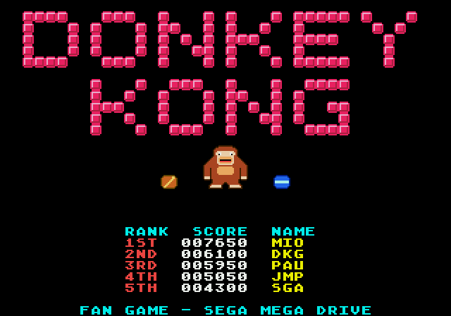
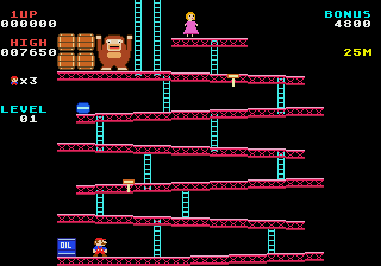
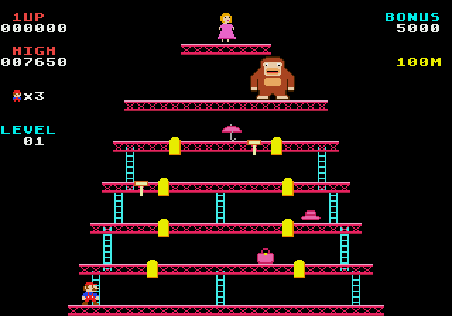

# Donkey Kong para Mega Drive

Remake do Donkey Kong clássico feito em **C** com o **SGDK**. Roda em Mega Drive / Genesis de verdade e em emuladores, como o **RetroArch** (núcleos Genesis Plus GX ou PicoDrive).

A ROM já compilada está em **`rom/DonkeyKong.bin`**. É só carregar no RetroArch.

| Título | 25 m | 100 m |
|---|---|---|
|  |  |  |

## Conteúdo do jogo

- **Tela de título** com logo, Kong animado e ranking dos 5 melhores.
- **Tela "HOW HIGH CAN YOU GET?"** antes de cada fase.
- **25 m (barris):** o Kong joga barris que rolam pelas vigas inclinadas, descem escadas e caem nas pontas. O barril azul acende o tambor de óleo e solta bolas de fogo. Há escadas quebradas e 2 martelos. O objetivo é chegar até a Pauline.
- **100 m (rebites):** passe por cima dos 8 rebites amarelos para arrancá-los. Cada rebite arrancado deixa um buraco no piso: é preciso pular por cima dele, e quem cai no buraco morre. Bolas de fogo aparecem nas pontas e não atravessam buracos. Tem bolsa, chapéu e guarda-chuva para coletar. Quando o último rebite sai, o Kong despenca.
- **Níveis infinitos:** a cada volta os barris ficam mais rápidos, o Kong joga mais barris e aparecem mais bolas de fogo.
- **Bônus:** um contador desce 100 a cada 2 segundos. Se chegar a zero, você perde uma vida. O que sobrar vira pontos ao terminar a fase.
- **Vida extra** aos 10.000 pontos.
- **Recorde salvo:** os 5 melhores ficam gravados na SRAM (bateria). O jogador digita as iniciais. No RetroArch isso vira um arquivo `.srm` e o ranking continua lá depois de desligar.
- **Som** com música e efeitos no chip PSG.
- **Pausa** com START.

### Pontuação

| Ação                                  | Pontos          |
|---------------------------------------|-----------------|
| Pular um barril ou uma bola de fogo   | 100             |
| Destruir um barril com o martelo      | 300 (azul: 500), às vezes 800 |
| Destruir uma bola de fogo             | 500, às vezes 800 |
| Arrancar um rebite                    | 100             |
| Bolsa / chapéu / guarda-chuva         | 300 / 500 / 800 (conforme o nível) |
| Bônus restante no fim da fase         | valor do bônus  |

## Controles

Todos os botões de ação servem para pular. Assim o controle funciona do mesmo jeito em qualquer mapeamento, inclusive num **controle estilo NES** como o controle gigante da foto:

| Controle          | Ação                                           |
|-------------------|------------------------------------------------|
| Direcional ← →    | Andar                                          |
| Direcional ↑ ↓    | Subir / descer escada                          |
| A, B ou C (NES: A ou B) | Pular                                    |
| START             | Começar / pausar                               |

Com o martelo na mão, o Mario não pula nem sobe escada. O martelo bate sozinho.

## Como jogar no RetroArch

1. Instale o RetroArch e baixe o núcleo **Sega - MS/GG/MD/CD (Genesis Plus GX)** em *Menu Principal → Carregar Núcleo → Baixar um Núcleo*.
2. Abra *Carregar Conteúdo* e escolha `rom/DonkeyKong.bin`.
3. Para um evento (controle gigante + TV), vale a pena:
   - ligar a tela cheia em *Configurações → Vídeo → Tela Cheia*;
   - configurar o controle em *Configurações → Entrada → Controles da Porta 1*: ligue o direcional, o START e os botões A/B do controle nos botões do RetroPad;
   - abrir o jogo direto pela linha de comando:
     ```
     retroarch -f -L <pasta_dos_nucleos>/genesis_plus_gx_libretro.dll rom/DonkeyKong.bin
     ```
     (no Linux o núcleo é `genesis_plus_gx_libretro.so`).

O ranking é salvo sozinho na pasta `saves` do RetroArch.

## Como compilar

### Windows (SGDK)

1. Baixe o [SGDK](https://github.com/Stephane-D/SGDK) (versão 2.00 ou mais nova) e extraia, por exemplo, em `C:\sgdk`.
2. Crie a variável de ambiente `GDK=C:\sgdk`.
3. Na pasta do projeto, rode:
   ```
   build.bat
   ```
   A ROM sai em `out\rom.bin` e é copiada para `rom\DonkeyKong.bin`.

### Linux / macOS

Com Docker (imagem oficial do SGDK):
```
make docker
```
Ou com um SGDK local e um toolchain `m68k-elf`:
```
make GDK=/caminho/do/sgdk
```

> **Atenção:** use um compilador `m68k-elf` (bare-metal), que é o que o SGDK traz. O `gcc-m68k-linux-gnu` dos repositórios do Ubuntu/Debian gera acessos de memória desalinhados, que funcionam no 68020 mas **não no 68000** do Mega Drive, e a ROM sai com defeito.

## Estrutura do código

```
inc/game.h      constantes, estado global compartilhado
inc/gfx.h       índices de tiles/sprites e paletas
inc/sound.h     músicas e efeitos
src/main.c      fluxo do jogo: título, intermissão, HUD, game over, ranking (SRAM)
src/game.c      jogabilidade: fases 25 m e 100 m, Mario, Kong, barris, fogo, martelo, rebites
src/gfx.c       toda a arte em pixel art como texto (fácil de editar) + conversão para tiles
src/sound.c     motor de som no PSG (música em 2 canais + efeitos)
src/rom_header.c cabeçalho da ROM (declara a SRAM para salvar o ranking)
```

Todos os gráficos estão desenhados como texto dentro de `src/gfx.c`. Cada caractere é um pixel: `.` é transparente e `1`–`F` são cores da paleta. Para mudar um sprite, edite o desenho e recompile.

---
Jogo de fã, sem fins comerciais. Donkey Kong é marca registrada da Nintendo.
